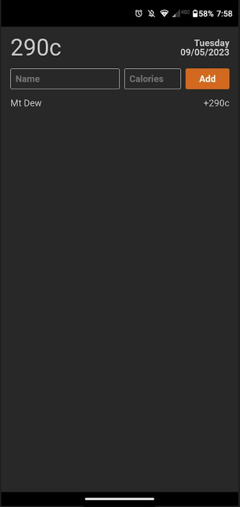

09/05/2023

7:22 PM

today is a 3.25 hour sleep day so I'm pretty spent

There are a number of reasons I have to use RN going forward, not half-ass it anymore.

Twilio did this 10DLC thing so I'll have to make real push notifications somehow even if it's not using RN.

My PWA apps are not reliable like if the source URL isn't reachable they won't load even though they should.

Maybe it's an initial save idk... anyway I have to start developing mobile apps anyway, my free personal finance app project has stalled.

Been dealing with life/other things.

Also need to use local storage eg. sqlite which I've gotten better at

I won't get much done today since I cook in half an hour and then I'll eat/game then sleep

Also I pinched my back or something like if I move the wrong way I almost collapse from the pain

Gotta start doing my back stretches again

7:32 PM

ugh... distracted social media man

I have a phone again so it's nice to develop this, I [smashed the screen a month ago and was stuck with a T9](https://medium.com/@jdc-cunningham/t9-my-old-friend-19945dfca90c)

If I can see the android virtual device that'll be good for now

7:41 PM

lol I see my past trying to get BLE to work for Monocle (old AVD opened)

Also says host GPU changed (sold my 3080Ti FE sad)

It's massive/trying to shrink down

Okay got it to RN nice

Main things I need to do are sqlite store and then sideload/get the thing on my phone, rest of it is standard dev

7:45 PM

yeah sadly I'm mad spent today, will hit this up tomorrow

7:59 PM

oh yeah I forgot, this is the UI of the PWA one that I've been using

So I'll just reproduce that
